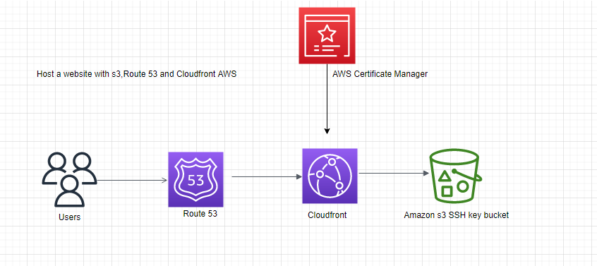
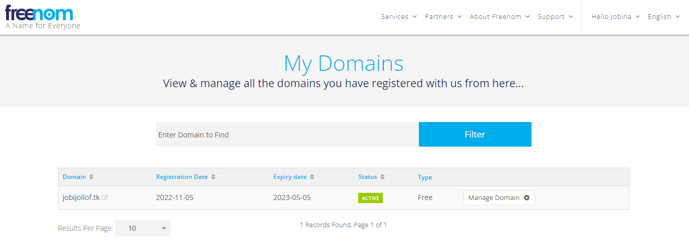
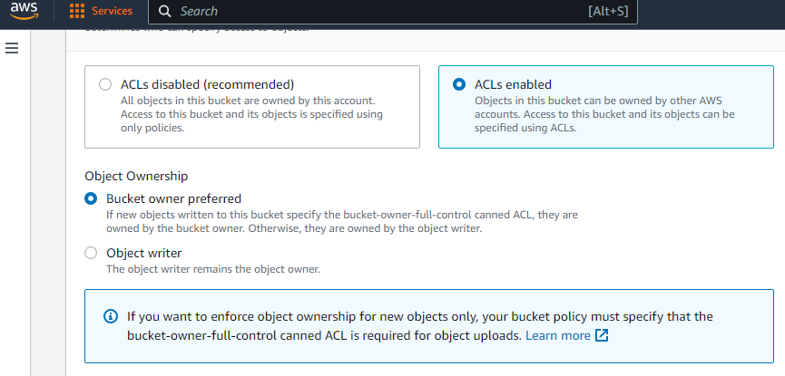
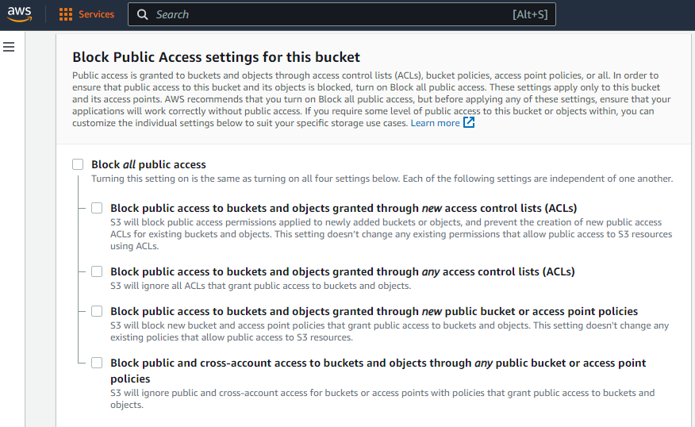
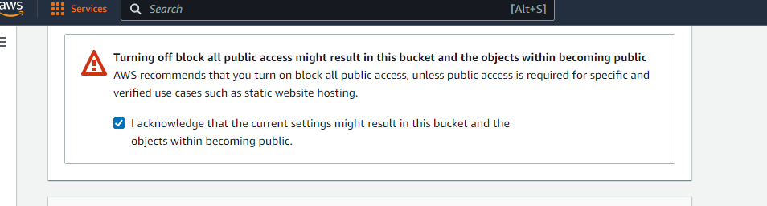
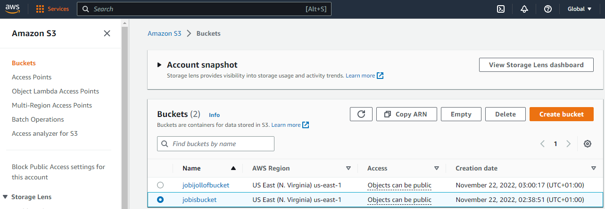
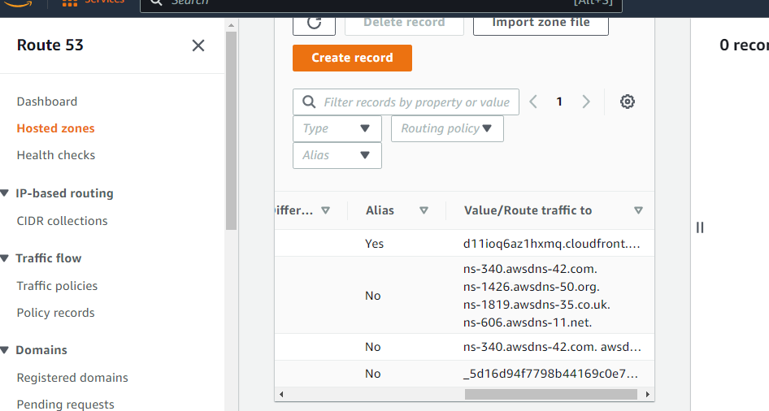
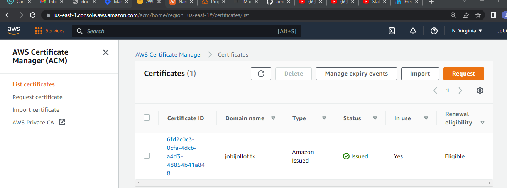
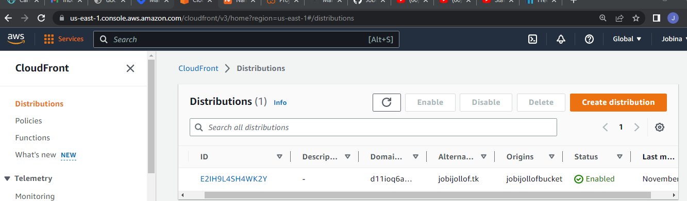
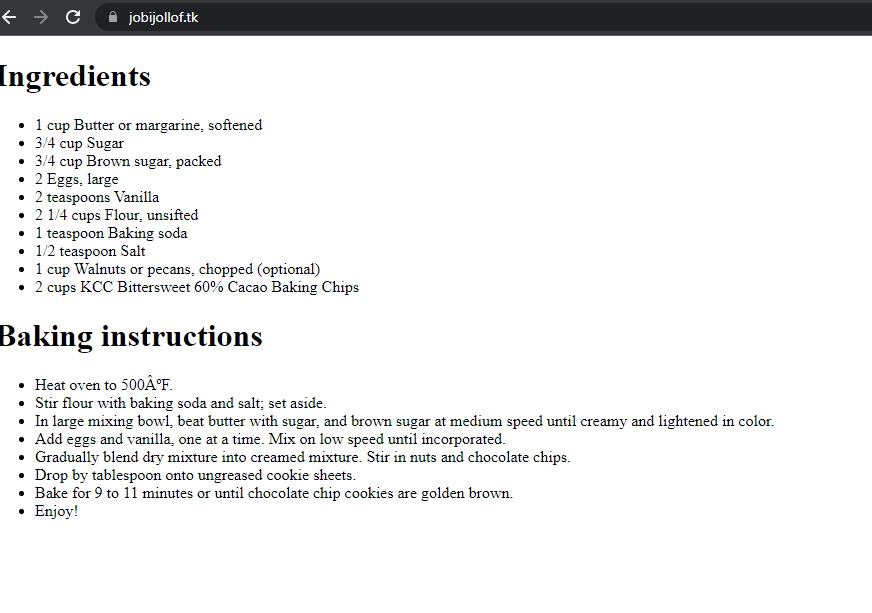

## aws-static-website
Deploy Static website to AWS with HTTPS-S3, Route 53,Cloud Front and certificate manager

Set up custom domain with SSL

Requirement: basic understanding of AWS

Overview: User, types domain name, Route 53 will route user to cloud front. AWS Certificate manager will provide HTTPS certificate. Cloud front will reach out to Amazon S3 bucket to get website content to serve the user.

Lets get to it.

# Step 1. Get a Free Domain Name.

Sign up/in to [Freenom](https://www.freenom.com/en/index.html?lang=en) to get a free domain name.

- Drop down Services
- Click on register a new doamin
- Check Availability of name
- Click on get it now
- Checkout
- Fill the review and checkout form
- click on i have read the agreement
- Complete order
- Verify email 
After verification of email address
- Click on services
- My domain(domain name is meant to be available)

 If you dont see the above output with domain name active, kindly go back and retake the steps.

#  Step 2. Create an S3 Bucket
- Choose a region 
- Click on Create Bucket ( Name of bucket have to be globally unique)
- Object Ownership - Click on ACL enabled 

- Grant Public access

- Acknowledge that you are granting public access to the objects.

- Leave everyother option as default
-  Click on create bucket
- Upload your objects (any type of file images,backups,data,movie. The maximum size of a file that can be upoaded by using the Amazon S3 Console is 160 GB. To upload a file larger than 160 GB, use the AWS CLI,AWS SDK, or Amazon S3 REST API.)
- Click on properties
- Click on Edit for Static Website hosting
- Click on Enable
- write the type of file Index.html and Error.html
- Save Changes
- Click on objects
- Click on Actions 
- Click on make Public Acl( if this is not done the static website will not host)

# Step 3. Route 53
Route 53 is a highly available scalable domain name service
Configure a hosted zone on Route 53
- DNS Management
- Click on create hosted Zone
- Domain name = domain name from  [Freenom](https://www.freenom.com/en/index.html?lang=en)
- Leave as public hosted zone
- Click on Create
- Go back to [Freenom](https://www.freenom.com/en/index.html?lang=en)  
- Click on manage domain
- Click on Management tools
- Click on name servers
- Click n use custom domain server
- Go back to Route 53 (Click on the hosted zone with NS and copy the fourname servers)

 

- Copy the nameservers from the hosted zone (NS) in  Route 53  and replace them with one in Freenom.
- Click on change name 

# Step 4 Create SSL Certificate using AWS Certificate Manager
This is a service by AWS that amkes it easy to provision, manage,deploy and renew SSL/TLS Certificate.
It is a service that makes sure that user information is encrypted while being transported to the server
- Search for AWS Certificate Manager in Services
- Click on get started to provision Certificate.
- Request Public certificate
- Paste your registered domain name
- Click on next
- Click on DNS validation - review - cofirm - contiune
- Expand the small buttton arrow by doamin name
- Click on create record in Route 53
- Click on Create
ouput = Pending validation then after a while output will be - issued

 

# Step 5. Cloudfront.
This an AWS service that speeds up distribution of Static and dynamic websites. It is content delivery network with large number of data centers which are called edge loactions.
- Click on Create Distribution
- Select web version
- Origin name = Url of the static website without https (this is very important)
# Default Cache Behaviour
- click on redirect HTTP to HTTPS
# Distribution Settings
Alternate Doamin name CNAME = domain name with http or slash
# SSL Certificate
- Click on custom SSL Certificate
- Click on Create distribution
Status = pending - enabled

 

Finally go back to Route 53
- Click on hosted Zone
- Click on the domain name
- Click on create Record
- Leave the default setting except alias
- Click on alias and pick cloudfront distribution
- Click on create 
 
